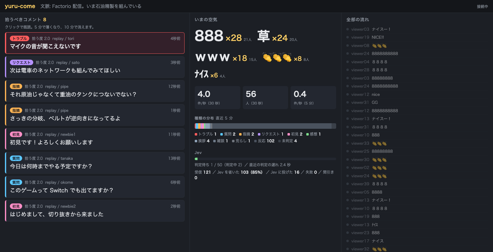
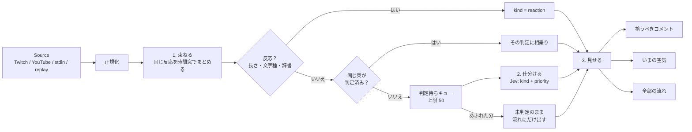

# yuru-come（ゆるコメントビューワー）

配信のコメントを**全部読まなくていい**ようにする、拾い上げ専用パネルです。

コメントが多い配信では、質問や初見の挨拶が「草」「www」「8888」の波に埋もれます。yuru-come は同じ反応を束ねて「草 ×48」にまとめ、残った中身のあるコメントだけを [TypeSafe Jev](https://docs.typesafe.ai/) に仕分けさせて、配信者が拾うべきものを左の枠に出します。



既存のコメントビューワー（わんコメ、マルチコメントビューア、CastCraft など）の置き換えではありません。それらは複数サイトのコメントを 1 画面に集めて流す・読み上げるための道具で、yuru-come はその横に置く「拾い上げ専用」の画面です（[既存のコメントビューワーとの併用](#既存のコメントビューワーとの併用)）。

## 処理の流れ



1. **束ねる（Jev を使わない）**: コメントを正規化して、同じ反応を 30 秒の時間窓の中でまとめます。
2. **仕分ける（Jev）**: 束ねられなかった中身のあるコメントだけを Jev に投げ、種類（kind）と「配信者が拾うべき度」（priority）を 1 リクエストで判定します。Jev は文章を生成しない判断専用モデルで、型付きの質問に確率分布で答えます。
3. **見せる**: 3 枠のダッシュボードに出します。

Jev が遅くてもチャットの読み取りは止めません。判定待ちが上限を超えたら、古くて短いコメントから「未判定のまま全部の流れにだけ出す」扱いにして落とします。

## セットアップ

[MoonBit](https://www.moonbitlang.com/download/)（moon 0.1.20260915 以降）と、Jev 互換の判定サーバが必要です。

```bash
git clone https://github.com/hiroyannnn/yuru-come
cd yuru-come
moon build --target native
```

判定サーバは環境変数で選びます。

| 環境変数 | 既定 | 意味 |
| --- | --- | --- |
| `JEV_URL` | `http://127.0.0.1:8000` | Jev 互換 API のベース URL（`POST /v1/systemone`） |
| `JEV_API_KEY` | `local` | Bearer トークン |
| `JEV_MODEL` | `jev-latest` | リクエストに載せるモデル名 |
| `YOUTUBE_API_KEY` | なし | `--source youtube` のときだけ必要 |

本家 Jev は Vercel AI Gateway 経由で使えます。

```bash
export JEV_URL=https://ai-gateway.vercel.sh/typesafe
export JEV_MODEL=typesafe-ai/jev
export JEV_API_KEY=<AI Gateway の API キー>
```

ローカルで試すなら [open-jev](https://github.com/daseinlabs/open-jev)（Gemma 3 4B）を `127.0.0.1:8000` で起動します。ただし open-jev は score 質問（priority）がほぼ常に最大値になり、1 リクエストに 1.3 秒ほどかかります。open-jev で使うときは `--priority-threshold 2.1` を付けて種類だけで拾ってください（[評価結果](#評価結果)）。

## 使い方

```bash
moon run --target native cmd/yuru-come -- --source twitch --twitch <channel> --port 8791
```

`http://127.0.0.1:8791/` を開くとダッシュボードが出ます。配信者が自分で見る画面で、OBS に載せるものではありません。

| オプション | 既定 | 意味 |
| --- | --- | --- |
| `--source stdin\|twitch\|youtube\|replay` | `stdin` | コメントの入口。複数指定可 |
| `--sink web\|terminal` | `web` | 出口。複数指定可 |
| `--context <text>` | なし | Jev に渡す配信の文脈（配信タイトルや話題）。指摘や質問の判定が安定します |
| `--port <n>` / `--host <addr>` | `8791` / `127.0.0.1` | ダッシュボードの待ち受け |
| `--workers <n>` | `2` | 並行して Jev に投げる本数。本家 Jev なら増やせます |
| `--queue-limit <n>` | `50` | 判定待ちキューの上限 |
| `--window <sec>` | `30` | 反応を束ねる時間窓 |
| `--threshold <0..1>` | `0.85` | 短いコメントを同一視する類似度の下限 |
| `--metric levenshtein\|jaro-winkler` | `levenshtein` | 類似度の種類 |
| `--reaction-word <word>` | なし | 早期判定の辞書に足す語。複数指定可 |
| `--priority-threshold <0..2>` | `1.5` | この priority 以上なら種類によらず拾う。2 より大きくすると種類だけで拾う |

### Source

**Twitch**: IRC に匿名（`justinfan…`、読み取り専用）で接続します。キーもログインも要りません。エモートは `emotes` タグの位置から名前を取り出し、スタンプとして扱います。

```bash
moon run --target native cmd/yuru-come -- --source twitch --twitch <channel> --context "配信の話題"
```

**YouTube Live**: Data API v3 を API キーでポーリングします（公開ライブなら OAuth 不要）。`<videoId>` は `watch?v=` の後ろです。

```bash
export YOUTUBE_API_KEY=<API キー>
moon run --target native cmd/yuru-come -- --source youtube --youtube <videoId>
```

**複数同時**: `--source` を並べます。

```bash
moon run --target native cmd/yuru-come -- --source twitch --twitch <channel> --source youtube --youtube <videoId>
```

**stdin**: `参加者ID<TAB>発言` を 1 行ずつ読みます。TAB が無い行は匿名の発言です。ほかのツールからパイプするための入口です。

```bash
printf 'alice\tこれ何のゲームですか？\nbob\t草\n' | moon run --target native cmd/yuru-come -- --source stdin --sink terminal
```

**replay**: `時刻ms<TAB>参加者ID<TAB>発言` の TSV を `--speed N` 倍速で再生します。高流速のテストと開発用です。`samples/wave.tsv` は、反応の波に質問・初見・指摘・トラブル報告・荒らしが埋もれている約 2 分の合成ログ（200 行）です。

```bash
moon run --target native cmd/yuru-come -- --source replay --replay samples/wave.tsv --speed 10
```

**TikTok（非公式・不安定）**: TikTok には公式のコメント取得 API がありません。`tools/tiktok-bridge/` は、Node の非公式ライブラリ [tiktok-live-connector](https://github.com/zerodytrash/TikTok-Live-Connector) でコメントを受けて標準出力に流すだけの小さなブリッジで、stdin Source にパイプして使います。TikTok 側の仕様変更で予告なく動かなくなります。このブリッジは実際の TikTok LIVE では未検証です。ライブラリは MIT で配布された最後の版 2.4.0 に固定しています（2.4.1 以降は AGPL-3.0-only）。

```bash
(cd tools/tiktok-bridge && npm install)
node tools/tiktok-bridge/bridge.mjs <TikTok のユーザー名> \
  | moon run --target native cmd/yuru-come -- --source stdin --stdin-source tiktok
```

### Sink

**web**（既定）: 下の 3 枠のダッシュボードです。`GET /api/state` が全状態の JSON、`POST /api/dismiss`（`{"id": <項目 ID>}`）が拾い上げの既読です。静的ファイルは `web/` にある素の HTML / CSS / JS で、外部ライブラリは使っていません。

**terminal**: 拾うべきコメントだけを 1 行ずつ出します。デバッグと最小構成用です。

```
!! [トラブル 2.0] twitch/Alice: マイクの音が聞こえないです
[質問 1.3] twitch/Bob: 今日は何時までやる予定ですか？
```

## ダッシュボードの見方

- **左「拾うべきコメント」**: 種類のバッジ、拾う度（priority）、投稿者とプラットフォーム。クリックで既読にして消します。5 分たつと薄くなり、10 分で消えます。配信トラブルの報告は赤い枠で最上位に固定します。並びは priority の高い順、同じなら新しい順です。同じコメントが重ねて来たら「同じコメント ×3」と出ます。
- **中「いまの空気」**: 直近 30 秒の反応の束を、件数が多いほど大きく出します（「草 ×48 20人」）。その下に流速（件/秒）と参加者数、直近 5 分の種類の分布、Jev の判定待ち（滞留）と直近の判定の遅れ、Jev を省いた割合、間引いた件数が出ます。
- **右「全部の流れ」**: 従来のビューワーに相当する全コメントです。反応は薄く、荒らしと判定されたコメントは折りたたみ、拾い上げに入ったコメントは色つきで出ます。判定待ちは白抜きの丸、間引いたコメントは「未判定（間引き）」と出ます。

## kind の一覧

| kind | 意味 | 拾う？ |
| --- | --- | --- |
| `question` | 配信者への質問 | 拾う |
| `request` | リクエスト・提案・指示 | 拾う |
| `correction` | 指摘・ツッコミ・ミスの報告 | 拾う |
| `first_time` | 初見・初コメを名乗る挨拶 | 拾う |
| `trouble` | 配信トラブルの報告（音が出ていない、画面が止まった等） | 拾う（最上位に固定） |
| `feedback` | 感想・応援 | priority ≥ 1.5 なら拾う |
| `greeting` | 挨拶 | priority ≥ 1.5 なら拾う |
| `chatter` | 視聴者同士の雑談・独り言 | priority ≥ 1.5 なら拾う |
| `abuse` | 荒らし・誹謗中傷・スパム | 拾わない。流れでも折りたたむ |
| `reaction` | 短い反応。Jev を呼ばずに早期判定で決まる | 拾わない |
| `unjudged` | 未判定（流量制御で間引いた、または判定に失敗した） | 拾わない |

priority は Jev の score 質問（「拾わなくてよい」「余裕があれば拾う」「今すぐ拾うべき」）の期待値で、0〜2 の実数です。

## 束ねと早期判定のルール

**正規化**（束ねのキーを作るだけで、Jev と画面には原文を渡します）

- 全角英数・記号を半角に、半角カナを全角に、カタカナをひらがなに、大文字を小文字にそろえる
- 前後と連続の空白を除く
- 同じ文字の連続を 1 文字にする（`wwww`→`w`、`草草草`→`草`、`うおおおお`→`うお`）。数字は全桁が同じとき（`8888`）だけ圧縮し、`1000` は壊さない
- 末尾の記号ゆれ（`！？。ー〜…`）と、日本語の直後の笑いの `w` を除く（`それはないわwww`→`それはないわ`）
- Twitch のエモート名と YouTube の `:emoji:` はトークンとして保持し、同じスタンプの連続は 1 個にする

**束ね**: 正規化後の完全一致に加えて、12 文字以下の短いコメントは文字列類似度（[hiroyannnn/strsim](https://github.com/hiroyannnn/strsim) の正規化 Levenshtein、既定の閾値 0.85）でも同じ束にします。束は件数・参加者数・最終時刻・代表テキスト（いちばん短い原文）を持ち、時間窓（既定 30 秒）を過ぎた分は件数から外れ、空になった束は消えます。

**相乗り**: 束の先頭のコメントだけを Jev に投げ、同じ束に入った後続は先頭の判定を引き継いで Jev を呼びません。先頭が拾い上げに入っていれば、その項目の件数が増えます。ただし、質問や指摘のような拾うべき種類の束に**類似度だけ**で入ったコメントは相乗りさせず、個別に判定します（「これ何の曲ですか」を「これ何の本ですか」の束に埋もれさせないため）。

**早期判定**（Jev を呼ばずに `reaction` と決める）

1. 空、スタンプだけ、記号・数字・絵文字だけ
2. 文字の部分が辞書にある、または正規化して 1 文字
3. 同じ文字を 3 回以上伸ばした、正規化後 4 文字以下の叫び（`きたあああ`）。疑問符つきは除く

短いだけでは決めません。「なぜ」「やめて」「初見」は Jev に回します。辞書は `lib/reaction.mbt` の `default_reaction_words` で、`--reaction-word` で足せます。

**流量制御**: 判定待ちは新しいものから判定します。キューが上限を超えたら、古い半分のうちいちばん短いコメントを未判定のまま流します。

## 評価結果

`eval/comments.tsv` は、種類と「拾うべきか」を付けた日本語コメント 70 件の合成データです。`cmd/eval` は本番と同じ早期判定とリクエストで 1 件ずつ仕分けて、正解率・混同行列・所要時間を出します。

```bash
moon run --target native cmd/eval
JEV_URL=https://ai-gateway.vercel.sh/typesafe JEV_MODEL=typesafe-ai/jev JEV_API_KEY=... moon run --target native cmd/eval
```

2026-09-20 時点、ローカルの open-jev（Gemma 3 4B）での結果です。本家 Jev では未計測です（手元に API キーが無かったため）。

| 指標 | open-jev（Gemma 3 4B） |
| --- | --- |
| kind の正解率（早期判定 + Jev） | 61 / 70 = 87.1% |
| kind の正解率（Jev に投げた分だけ） | 55 / 64 = 85.9% |
| 拾うべきか: 種類だけで拾う | 適合率 97.2% / 再現率 97.2% |
| 拾うべきか: 種類 または priority ≥ 1.5（既定） | 適合率 62.1% / 再現率 100% |
| 1 リクエスト（2 質問）の所要時間 | 平均 1340ms / 中央値 1187ms / p95 1996ms |

| 正解＼判定 | question | request | feedback | correction | greeting | first_time | trouble | abuse | chatter | reaction |
| --- | --- | --- | --- | --- | --- | --- | --- | --- | --- | --- |
| question | 8 | 0 | 0 | 0 | 0 | 0 | 0 | 0 | 0 | 0 |
| request | 1 | 6 | 0 | 0 | 0 | 0 | 0 | 0 | 0 | 0 |
| feedback | 0 | 0 | 7 | 0 | 0 | 0 | 0 | 0 | 0 | 0 |
| correction | 0 | 0 | 0 | 7 | 0 | 0 | 0 | 0 | 0 | 0 |
| greeting | 0 | 0 | 0 | 0 | 3 | 0 | 0 | 0 | 3 | 0 |
| first_time | 0 | 0 | 0 | 0 | 0 | 6 | 0 | 0 | 0 | 0 |
| trouble | 0 | 0 | 0 | 1 | 0 | 0 | 6 | 0 | 0 | 0 |
| abuse | 0 | 0 | 0 | 0 | 0 | 0 | 0 | 5 | 1 | 0 |
| chatter | 0 | 0 | 0 | 1 | 0 | 0 | 0 | 0 | 7 | 0 |
| reaction | 0 | 0 | 1 | 0 | 0 | 0 | 0 | 0 | 1 | 6 |

分かったこと:

- **open-jev の priority は使えません。** Gemma 3 4B は score 質問にほぼ常に最大値（1.95〜2.00）を返します。「眠くなってきた」も「音が出てないよ」も 2.0 です。段階の並びを逆にしても 5 段階にしても傾向は変わりませんでした。既定の「priority ≥ 1.5 なら拾う」のままだと感想も雑談も全部拾ってしまうので、open-jev では `--priority-threshold 2.1` で種類だけで拾ってください。本家 Jev は確率が適度ににじむので、既定のままで動く想定です。
- **criteria は定義を先に書く。** 例だけを並べた説明文では kind の正解率が 78.6% でしたが、「配信者への質問。配信者に答えてほしいことを尋ねている。」のように定義を先に書いて例を続ける形にすると 87.1% になりました（例は評価セットと重ならないもの）。とくに trouble が 3/7 から 6/7 に上がりました。
- **外れやすいもの**: 用件つきの挨拶（「お風呂入ってくるので離脱します、おつでした」→ chatter）、疑問形のトラブル報告（「音ズレしてませんか？」→ correction）、URL つきのスパム（→ chatter）、視聴者どうしのツッコミ（「上のコメントの人、それネタバレじゃない？」→ correction）。拾うべきかどうかにはほとんど響きません。
- **早期判定のすり抜け**: 「うますぎて草」「ないすぅ！」は辞書に無く Jev に回りました。害は Jev を 1 回余分に呼ぶことだけです。

### 流速に追いつけるか

`samples/wave.tsv`（200 件）を open-jev で再生した結果です（`--priority-threshold 2.1`）。

| 再生速度 | 流速 | Jev に投げた割合 | 判定待ちのピーク | 間引き |
| --- | --- | --- | --- | --- |
| 1 倍速 | 平均 1.7 件/秒、ピーク 14 件/秒 | 21%（79% は早期判定と相乗りで省略） | 0 / 50 | 0 件 |
| 10 倍速 | 平均 16.5 件/秒、ピーク 68 件/秒 | 21%（79% は早期判定と相乗りで省略） | 34 / 50 | 0 件 |
| 10 倍速、`--queue-limit 20` | 同上 | 12% | 20 / 20 | 19 件 |

1 倍速では判定待ちは溜まらず、拾い上げはコメントの到着から 1〜2 秒で出ます。10 倍速では 12 秒で流し終え、判定待ちを捌き終えるまでさらに 40 秒かかりました。どちらも取り込みは一度も止まらず、ダッシュボードも 1 秒ごとに更新され続けました。

実在の配信中の Twitch チャンネル（日本語、4.6〜6.6 件/秒、5 分で約 540 人が発言）に匿名接続した結果です。実際のチャットは辞書に無い短い雑談が多く、早期判定と相乗りで省けたのは 26〜29% でした。open-jev は 1 秒に 0.75 件しか捌けないので、判定待ちは上限に張り付き、約半分が未判定のまま流れました。それでも取り込みとダッシュボードは止まらず、判定待ちを新しい順に捌くことで、拾い上げはコメントの到着から 2.5〜3 秒で出ています（先入れ先出しでは 28〜42 秒遅れでした）。この流速で全部を仕分けるには、本家 Jev と `--workers` の増加が必要です。

## 既存のコメントビューワーとの併用

yuru-come はコメントの読み上げも、OBS へのコメント表示も、複数サイトの一覧もしません。それらは今お使いのコメントビューワーに任せて、yuru-come はサブモニタの隅に置いてください。

- **どちらも同じ配信に別々に接続します。** Twitch は匿名の読み取り専用接続、YouTube は API キーでのポーリングなので、配信者のアカウントにも既存のビューワーにも影響しません。YouTube は Data API のクォータを消費します。
- **見るのは左の枠だけで構いません。** 流れを追うのは既存のビューワーか読み上げに任せ、左の枠に何か出たら拾う、という使い方です。
- **荒らしの対処はしません。** 折りたたんで目に入りにくくするだけです。BAN やタイムアウトは各サイトのモデレーション機能を使ってください。
- わんコメなどのログや WebSocket 出力を `参加者ID<TAB>発言` に変換できれば、`--source stdin` にパイプして取り込めます。

## ライブラリとして使う

コア（`lib/`）は純粋な MoonBit で、wasm / wasm-gc / js / native の全ターゲットで動きます。ルートパッケージから再エクスポートしています。

```mbt check
///|
test "正規化して束ねる" {
  let bundler = @lib.Bundler::new()
  for text in ["草", "草www", "草草草！"] {
    let comment = @lib.Comment::new("demo:viewer", text)
    bundler.add(@lib.normalize(text), comment, 0) |> ignore
  }
  let top = bundler.summaries(0)
  assert_eq(top[0].representative, "草")
  assert_eq(top[0].count, 3)
  assert_true(@lib.ReactionRules::new().is_reaction("きたあああ"))
  assert_false(@lib.ReactionRules::new().is_reaction("初見です"))
}
```

`Engine` は同期の状態機械です。`ingest` でコメントを取り込み、`take_next` で判定待ちを受け取り、`complete` で判定結果を返し、`state` で画面用の全状態を得ます。Jev への問い合わせは呼び出し側（`runtime` と `jev`）の仕事なので、HTTP なしでテストできます。

| パッケージ | ターゲット | 役割 |
| --- | --- | --- |
| `lib` | 全部 | 正規化、束ね、早期判定、リクエスト組み立て、レスポンス解釈、拾い上げ、空気の集計、エンジン、各 Source のパーサ |
| `runtime` | native | Source の並行実行と、判定ワーカー（タイムアウトつき） |
| `jev` | native | Jev 互換 API の HTTP クライアント |
| `adapters/*` | native | stdin / twitch / youtube / replay の Source、terminal / web の Sink |
| `cmd/yuru-come` | native | CLI |
| `cmd/eval` | native | 評価コマンド |

```bash
moon test --target all
```

## 未実装・既知の制限

- 「いまの空気」を 30 秒ごとに一文にする LLM 要約は未実装です。
- 本家 Jev での評価と、YouTube Live での実機確認は未実施です。
- 正規化の連続圧縮は「ここ」→「こ」のような普通の語も縮めます。束ねのキーにしか使わないので表示は変わりませんが、まれに別のコメントが同じ束になります。
- 流量制御は短いコメントから落とすので、「音出てない」のような短くて大事な報告が、滞留中は未判定のまま流れることがあります。
- 絵文字の結合文字列（肌の色、ZWJ）は連続圧縮されません。
- Twitch のエモートは空白で区切られた語として照合します。`PogChamp!` のように記号がくっついたエモートは文字として扱われます。
- Twitch の接続が切れても再接続しません（ダッシュボードは動き続けます）。

## Acknowledgments

- [hiroyannnn/yuru-poll](https://github.com/hiroyannnn/yuru-poll)（Apache-2.0）: Twitch / YouTube / stdin のパーサとアダプタ、Jev クライアント、runtime、web サーバの骨格、CLI の解釈をコピーして直しています。
- [hiroyannnn/strsim](https://github.com/hiroyannnn/strsim)（Apache-2.0、strsim-rs 由来のアルゴリズムは MIT）: 短いコメントの類似度。
- [moonbitlang/async](https://github.com/moonbitlang/async)（Apache-2.0）: イベントループ、ソケット、TLS、HTTP。
- [tiktok-live-connector](https://github.com/zerodytrash/TikTok-Live-Connector): `tools/tiktok-bridge` が利用者の `npm install` で取得します（2.4.0、MIT）。このリポジトリにコードは含みません。
- 判定は [TypeSafe Jev](https://docs.typesafe.ai/) と、その互換実装 [open-jev](https://github.com/daseinlabs/open-jev) を使います。

ライセンスは Apache-2.0 です。第三者の表示は [NOTICE](NOTICE) にあります。
